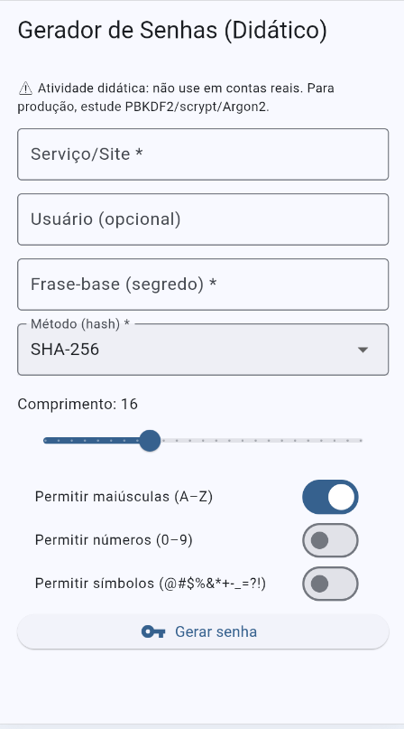
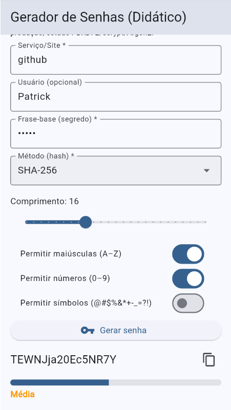

# Gerador de Senhas Flutter

## Como Executar

Clone o repositório:
```bash
git clone https://github.com/PatrickFernandesdaConceicao/password_generator_flutter.git
```

Instale as dependências:
```bash
flutter pub get
```

Execute a aplicação:
```bash
flutter run
```

## Requisitos Funcionais

### Campos

| Campo | Obrigatório | Descrição |
|-------|-------------|-----------|
| Serviço/Site | ✔️ | Identificação do serviço (ex.: "email", "github") |
| Frase-base | ✔️ | Segredo pessoal do usuário usado como seed |
| Comprimento | ✔️ | Slider ajustável (8–32 caracteres) |
| Usuário | ❌ | Informação adicional opcional |
| Algoritmo | ✔️ | MD5, SHA-1 ou SHA-256 |
| Opções de caracteres | ✔️ | Maiúsculas, números e símbolos (ativados via switches) |

### Funcionalidades

- Validação de entradas obrigatórias
- Geração de senha determinística
- Exibição em fonte monoespaçada
- Cópia para o clipboard com feedback via SnackBar
- Indicador de força da senha (barra + texto explicativo)

## Requisitos Não Funcionais

- Interface simples e responsiva (1 tela)
- Código organizado, nomes claros e consistentes
- Processamento leve (não trava a UI)
- Comentários breves explicando decisões

## Algoritmos Disponíveis

- **MD5** → rápido, mas menos seguro; incluído para comparação/demonstrar compatibilidade
- **SHA-1** → mais seguro que MD5, ainda usado em sistemas legados
- **SHA-256** → algoritmo mais robusto e recomendado; usado também para expansão de bytes

Todos implementados via `package:crypto`.

## Decisões de Design

- **Determinístico**: a mesma entrada sempre gera a mesma senha, reduzindo a dependência de armazenamento externo
- **Expansão de bytes com SHA-256**: garante maior entropia e diversidade de caracteres mesmo para entradas pequenas
- **Interface única**: toda a interação acontece em uma tela, mantendo simplicidade para o usuário final
- **Separação lógica/UI**: geração da senha isolada em funções (`_expandBytes`, verificação via RegExp), facilitando testes e manutenção
- **Feedback imediato**: barra de força e SnackBar dão retorno rápido e claro ao usuário

## Bibliotecas Utilizadas

- `package:flutter/material.dart` — UI (inputs, botões, sliders, switches)
- `package:flutter/services.dart` — copiar senha para clipboard
- `dart:convert` — conversão UTF-8 e manipulação de bytes
- `dart:math` — geração determinística de índices
- `package:crypto/crypto.dart` — hash MD5, SHA-1, SHA-256

## Funções e Classes

### UI/Estado
- `Form`, `GlobalKey<FormState>` — validação do formulário
- `TextFormField`, `DropdownButtonFormField`, `Slider`, `SwitchListTile` — entradas do usuário
- `TextEditingController` — ler valores dos campos
- `ElevatedButton`, `IconButton`, `SnackBar` — ações e feedback
- `setState` — atualização da interface

### Conversões/Strings
- `utf8.encode(...)` — transformar a semente em bytes
- `RegExp` — verificar presença de maiúsculas, dígitos, símbolos

### Hash
- `crypto.md5.convert(...)`, `crypto.sha1.convert(...)`, `crypto.sha256.convert(...)`

### Utilidades
- `Clipboard.setData(ClipboardData(...))` — cópia da senha
- `_expandBytes(...)` — expansão determinística de bytes da semente
- `_StrengthBar` — widget simples de indicador de força

## Fluxo de Alto Nível

1. Coletar e validar os campos obrigatórios
2. Montar a semente: `algoritmo|serviço|usuário|frase-base`
3. Expandir bytes determinísticos usando SHA-256 iterativo
4. Mapear bytes para caracteres permitidos (minúsculas + opções selecionadas)
5. Garantir pelo menos um caractere de cada classe habilitada
6. Calcular força da senha (comprimento + diversidade de classes)
7. Exibir a senha e permitir cópia

## Demonstração



